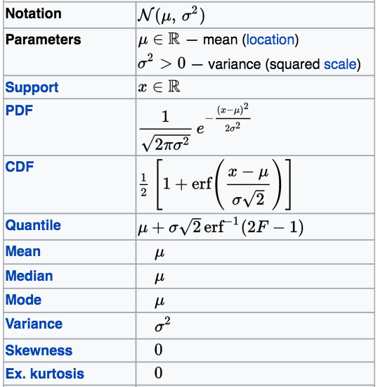

\huge{PART 1}

\LARGE

Probability theory from scratch


```{r setup, echo = FALSE}
library(graphicsutils)
myblue <- "#7eb6d6"
myred <- "#e080a3"
mygreen <- "#d4e09b"
mygrey <- "grey35"
mypar <- list(fg=mygrey, col.lab=mygrey, col.axis=mygrey, bg="transparent", las = 1, cex.main=2, cex.axis=1.4, cex.lab=1.4, bty="l")
```


# A few notes on History

- Chevalier De Méré, Pascal and Fermat: *the problem of points*
  - prediction based on data / envision outcomes


# A few notes on History

- Laplace *Théorie Analytique des Probabilités in 1812* and

- Reverend Bayes *An Essay Towards Solving a Problem in the Doctrine of Chances* 	(published posthumously)


# A few notes on History

- Kolmogorov / Mathematization

- Shannon / Tukey / Update information theory


# Examples


- Allesina and Tang, **Stability criteria for complex ecosystems**, *Nature* (2012), \pause
based on Tao, Vu & Krishnapur, **Random matrices: Universality of ESDs and the circular law**, *The Annals of Probability* (2010).

\pause

- Population genetics: a population = probability distribution of traits (random variables)

\pause

- Expending the classical TIB: short talk this pm!


<!-- 20 min  -->


# Probability space


\begin{large}
Let's flip a coin \pause and define $\left(\Omega, \mathcal{F}, P\right)$
\end{large}


\pause

1. $\Omega$: Sample space, *i.e.* set of all possible outcomes  

\begin{itemize}
     \item<6-8> "Head" "Tail"
\end{itemize}  

\pause

2. $\mathcal{F}$: set of events *i.e.* combinations of outcomes ($\sigma$-field)

\begin{itemize}
     \item<7-8> $\emptyset$, "Head", "Tail", "Head or Tail" ($\Omega$)
\end{itemize}   

\pause

3. $P$: maps events occurrence into [0,1]

\begin{itemize}
     \item<8-8> \alert<6>{$P(\emptyset)=0$};  $P("Head") = p$;  $P("Tail") = 1-p$; \alert<6>{$P(\Omega) = 1$}
 \end{itemize}  


# Probability space

\begin{large}
Occurrence of species 1 on an island
\end{large}

\pause


1. $\Omega$: Sample space set of all possible outcomes  

\begin{itemize}
     \item<2-4>  {"Present", "Absence"} ({"0", "1"})
 \end{itemize}  

\pause

2. $\mathcal{F}$: set of events *i.e.* 0 or more outcomes

\begin{itemize}
     \item<3-4> $\emptyset$, "0", "1", "1 or 0" ($\Omega$)
 \end{itemize}   

\pause

3. $P$: assign a probability / map events occurrence into [0,1]

\begin{itemize}
     \item<4-4> $P(\emptyset)=0$;  $P("1") = p$;  $P("0") = 1-p$; $P(\Omega) = 1$
 \end{itemize}  

 <!-- Understanding the difference between Omega and F is ++ -->
 <!-- The set of question F allows is huge and we need to combine outcomes properly -->


# Probability space

\begin{large}
  Occurrence of species 1 and species 2 on an island
\end{large}

\pause

1. $\Omega$: {"00", "01", "10", "11"}

\pause

2. $\mathcal{F}$: $\emptyset$, $\Omega$, "01", "at least one species"

\pause

3. $P$: $p_{00}$, $p_{01}$, ...


# Combining events

\large

Let "A" and "B" denotes two distinct events:

\pause

1. $A \cup B$: "A or B"
\pause

2. $A \cap B$: "A and B"
\pause

3. $\overline{A}$: "complement of A"
\pause

NB: $A \cup \overline{A} = \Omega$ and $A \cap \overline{A} = \emptyset$

\pause

NB: $P(\overline{A}) = 1 = P(A)$


# Combining events

```{r omega, echo = FALSE, fig.width=6, fig.height=4.5}
par(xaxs="i", yaxs="i")
plot0(c(0,1), fill=myblue)
text(.9,.1, label=expression(Omega), cex=2.6, col=mygrey)
box2(1:4, col=mygrey)
```

\LARGE $P(\Omega) = 1$


# Combining events

```{r emptySet, echo = FALSE, fig.width=6, fig.height=4.5}
##---
par(xaxs="i", yaxs="i")
plot0(c(0,1))
text(.9,.1, label=expression(bar(Omega)), cex=2.6, col=mygrey)
box2(1:4, col=mygrey)
```

\LARGE $P(\overline{\Omega}) = P(\emptyset) = 1 - P(\Omega) = 0$


# Combining events

```{r eventA, echo = FALSE, fig.width=6, fig.height=4.5}
rc1 <- c(.2,.4,.6,.8)
rc2 <-  c(.4,.2,.8,.6)
##---
par(xaxs="i", yaxs="i")
plot0(c(0,1))
rect(rc1[1], rc1[2], rc1[3], rc1[4], col = myblue, border=NA)
text(mean(rc1[c(1,3)]), mean(rc1[c(2,4)]), label="A", cex=2.6, col=mygrey)
box2(1:4, col=mygrey)
```

\LARGE $P(A)$


# Combining events

```{r complement, echo = FALSE, fig.width=6, fig.height=4.5}
par(xaxs="i", yaxs="i")
plot0(c(0,1), fill=myblue)
rect(rc1[1], rc1[2], rc1[3], rc1[4], col = "white", border=NA)
box2(1:4, col=mygrey)
text(.9,.1, label=expression(bar(A)), cex=2.6, col=mygrey)
```

\LARGE $P(\overline{A}) = 1 - P(A)$


# Combining events


```{r eventB, echo = FALSE, fig.width=6, fig.height=4.5}
par(xaxs="i", yaxs="i")
plot0(c(0,1))
rect(rc2[1], rc2[2], rc2[3], rc2[4], col = myblue, border=NA)
text(mean(rc2[c(1,3)]), mean(rc2[c(2,4)]), label="B", cex=2.6, col=mygrey)
box2(1:4, col=mygrey)
```

\LARGE $P(B)$


# Combining events

```{r interAB, echo = FALSE}
par(xaxs="i", yaxs="i")
plot0(c(0,1))
rect(rc1[1], rc1[2], rc1[3], rc1[4], col = NA, border=mygrey, lwd=.4)
rect(rc2[1], rc2[2], rc2[3], rc2[4], col = NA, border=mygrey, lwd=.4)
rect(rc2[1], rc1[2], rc1[3], rc2[4], col = myblue, border=NA)
text(.5*(rc2[1]+rc1[3]) , .5*(rc1[2]+rc2[4]), label= expression(A~intersect(B)), cex=2.6, col=mygrey)
box2(1:4, col=mygrey)
```

\LARGE $P(A \bigcap B)$


<!-- we assume this is known we'll come back latter on that -->


# Combining events


```{r eventAB, echo = FALSE, fig.width=6, fig.height=4.5}
par(xaxs="i", yaxs="i")
plot0(c(0,1))
rect(rc1[1], rc1[2], rc1[3], rc1[4], col = myblue, border=NA)
rect(rc2[1], rc2[2], rc2[3], rc2[4], col = myblue, border=NA)
text(mean(rc2[c(1,3)])-.1, mean(rc2[c(2,4)])+.1, label= expression(A~union(B)), cex=2.6, col=mygrey)
box2(1:4, col=mygrey)
```

\LARGE $P(A \bigcup B) = P(A) + P(B) - P(A \bigcap B)$


# Combining events

```{r complementAB, echo = FALSE}
par(xaxs="i", yaxs="i")
plot0(c(0,1), fill=myblue)
rect(rc1[1], rc1[2], rc1[3], rc1[4], col = "white", border=NA)
rect(rc2[1], rc2[2], rc2[3], rc2[4], col = "white", border=NA)
text(.85, .1, label= expression(bar(A~union(B))), cex=2.6, col=mygrey)
box2(1:4, col=mygrey)
```

\LARGE $P(\overline{A \cup B}) = 1 - P(A \cup B)$


# Combining events

```{r interAcomplB, echo = FALSE}
par(xaxs="i", yaxs="i")
plot0(c(0,1))
rect(rc2[1], rc2[2], rc2[3], rc2[4], col = myblue, border=NA, lwd=.4)
rect(rc1[1], rc1[2], rc1[3], rc1[4], col = "white", border = mygrey, lwd=.4)
rect(rc2[1], rc2[2], rc2[3], rc2[4], col = NA, border=mygrey, lwd=.4)

text(.5*(rc2[1]+rc2[3]), .5*(rc2[2]+rc2[4])-.1, label= expression(bar(A)~intersect(B)), cex=2.6, col=mygrey)
box2(1:4, col=mygrey)
```

\LARGE $P(\overline{A} \cap B) = P(B) - P(A \cap B)$


# Combining events - disjoint events

```{r disjoint, echo = FALSE}
par(xaxs="i", yaxs="i")
plot0(c(0,1))
rect(rc1[1]-.1, rc1[2], rc1[3]-.1, rc1[4], col = myblue, border=mygrey)
rect(rc2[1]+.1, rc2[2], rc2[3]+.1, rc2[4], col = myblue, border=mygrey)
text(mean(rc1[c(1,3)])-.1, mean(rc1[c(2,4)]), label="A", cex=2.6, col=mygrey)
text(mean(rc2[c(1,3)])+.1, mean(rc2[c(2,4)]), label="B", cex=2.6, col=mygrey)
box2(1:4, col=mygrey)
```

\LARGE $P(A \cap B) = 0$


# Combining events - partition

\large

Consider an event B \pause and a set of events: $A_i$ where i $\in$ \{1,...,n\} ($n$ a natural number) such as:

\pause

1. $\forall$ \{i, j\} \\ $i \neq j$, $P(A_i \cap A_j) = 0$ (pairwise disjoint)

\pause

2. $\bigcap_i^n A_i = B$ $\Rightarrow$ $\sum_i^n P(A_i) = P(B)$

\pause

then, the set $A_i$ is a partition of B.


# Combining events - partition

```{r partition1, echo = FALSE}
par(xaxs="i", yaxs="i")
plot0(c(0,1))
rect(rc2[1]+.1, rc2[2], rc2[3]+.1, rc2[4], col = myblue, border=mygrey)
text(mean(rc2[c(1,3)])+.1, mean(rc2[c(2,4)]), label="B", cex=2.6, col=mygrey)
box2(1:4, col=mygrey)
```


# Combining events - partition

```{r partition2, echo = FALSE}
par(xaxs="i", yaxs="i")
plot0(c(0,1))
rect(rc2[1]+.1, rc2[2], rc2[1]+.25, rc2[4], col = myblue, border=mygrey)
rect(rc2[1]+.25, rc2[2], rc2[1]+.4, rc2[4], col = darken(myblue, 25), border=mygrey)
rect(rc2[1]+.4, rc2[2], rc2[3]+.1, rc2[4], col = darken(myblue, 50), border=mygrey)
text(c(.58,.73,.85), rep(mean(rc2[c(2,4)]), 3), label=c("A1", "A2", "A3"), cex=2.6, col="white")
box2(1:4, col=mygrey)
```

\LARGE $P(B) = P(A_1 \cup A_2 \cup A_3) \pause = P(A_1) + P(A_2) + P(A_3)$


# Combining events - partition

```{r partition3, echo = FALSE, fig.width=6.5, fig.height=4.5}
layout(matrix(c(1,1,2,3,4,4,3,5,5),3,3))
par(xaxs="i", yaxs="i", mar=c(0,0,0,0))
for (i in 1:5){
  plot0(c(-1,1), c(-1,1), fill=darken(myblue, 12*(i-1)+1))
  text(0,0, paste0("A",i), cex=2.8, col="white")
}
```


# Combining events - partition

\large

$A_i$ where $i \in \{1, 2, 3, 4, 5\}$ is a partition of $\Omega$

$$\sum_i^5 P(A_i) = 1$$


# Combining events - formula (law) of total probability

\large

$A_i$ a partition of $\Omega$ and B an event:

$$P(B) = \sum_i^n P(B \cap A_i)$$


# Combining events - formula (law) of total probability

```{r partition4, echo = FALSE, fig.width=6.5, fig.height=4.5}
layout(matrix(c(1,1,2,3,4,4,3,5,5),3,3))
par(xaxs="i", yaxs="i", mar=c(0,0,0,0))
for (i in 1:5){
  plot0(c(-1,1), c(-1,1), fill=darken(myblue, 12*(i-1)+1))
  text(0,0, paste0("A",i), cex=2.8, col="white")
}
box2(1:4, col=mygrey, which = 'outer')
par(new = T, fig = c(0.2, .4, .1, .8))
plot0(fill="#CCCCCCCC")
text(0,0, "B", col="white", cex=2.8)
```


# Combining events - formula (law) of total probability

\large

$A_i$ where $i \in \{1, 2, 3, 4, 5\}$ is a partition of $\Omega$

$$P(B) = \sum_i^5 P(B \cap A_i)$$


# Occurrence of species 1 and species 2 on an island

\large

- Events: \{"00", "01", "10", "11"\}

\pause

- $P("00" \cap "01") = 0$

\pause

- $"00" \cup "01" \cup "10" \cup "11" = \Omega$

\pause

- \{"00", "01", "10", "11"\} is a partition of $\Omega$

\pause

- $p_{00}$ + $p_{01}$ + $p_{10}$ + $p_{11}$ = 1


# Occurrence of species 1 and species 2 on an island


- "00", "01", "10", "11" are **singleton sets** (a.k.a unit sets)

\pause

- \{"00", "01", "10", "11"\} a partition of $\Omega$ made of singleton sets

\pause

-  $p_{00}$, $p_{01}$, $p_{10}$, $p_{11}$

\pause

\vspace{.5cm}

Describes a **probability distribution**


# Let's practice 1 (15 min)

\begin{exampleblock}{PRACTICE 1}
  \begin{itemize}
      \item<1-4> $P(A \cup B \cup C)$
      \item<2-4> the duck hunter 1 bullet
      \item<3-4> the duck hunter 2 bullets / 2 ducks - 1 duck
      \item<4-4> bonus: how to simulate a dice with a coin?
  \end{itemize}    
\end{exampleblock}


# Let's practice 1 - $P(A \bigcup B \bigcup C)$

```{r eventABC, echo = FALSE}
par(xaxs="i", yaxs="i")
plot0(c(0,1))
##--
rect(rc2[1]+.1, rc2[2]+.1, rc2[3]+.1, rc2[4]+.1, col = myblue, border = NA, lwd=.4)
rect(rc1[1]+.1, rc1[2]+.1, rc1[3]+.1, rc1[4]+.1, col = myblue, border = NA, lwd=.4)
rect(rc2[1]-.15, rc2[2]-.05, rc2[3]-.15, rc2[4]-.05, col = myblue, border = NA, lwd=.4)
##--
rect(rc2[1]+.1, rc2[2]+.1, rc2[3]+.1, rc2[4]+.1, col = NA, border = mygrey, lwd=.4)
rect(rc1[1]+.1, rc1[2]+.1, rc1[3]+.1, rc1[4]+.1, col = NA, border = mygrey, lwd=.4)
rect(rc2[1]-.15, rc2[2]-.05, rc2[3]-.15, rc2[4]-.05, col = NA, border = mygrey, lwd=.4)
##--
text(c(.35,.8,.3), c(.8,.5,.2), labels=LETTERS[1:3], col=mygrey, cex=2)
box2(1:4, col=mygrey)
```

\LARGE $P(A \bigcup B \bigcup C) = ?$


# Let's practice 1 - the duck hunter

{width=50%}

\vspace{-.5cm}

- duck hunter, one bullet, one duck

- duck hunter, two bullets, two ducks

- duck hunter, two bullets, one duck


# Solution 1


<!--  x
 - See the [Inclusion–exclusion principle](https://en.wikipedia.org/wiki/Inclusion–exclusion_principle) article on wikipedia (formule du crible de Poincaré).
  -->


# Random variables

- Flipping a coin / occurrence of 1 species on an island / shooting a duck
\pause $\rightarrow$ we applied similar probabilistic approach.  

\pause

- *Success*: "Head", "Presence", "one dead duck" $\rightarrow$ **1**

\pause

- *Failure*: "Tails", "Absence", "no dinner tonight" $\rightarrow$ **0**

\pause

- Now let $X$ denote a variable such as:
  - $X=1$ success: $P(X) = p$ ;
  - $X=1$ failure:  $P(\overline{X}) = 1- p$

\pause

- Define a random variable + assign a probability distribution.


# Random variables and probability distribution

- A **random variable** $X: \Omega \rightarrow M$ where M is a measurable
space (natural number, real number, ...)

\pause

- A **probability distribution** \alert{$f$} is a function that assigns probability
under certain constraints:
\pause

  1. $f$ specifies $P$ for the partition of $\Omega$ made of singletons  
\pause

  2. $f$ defines $p_{0}$, $p_{1}$, $p_{2}$, $p_{3}$ such as $\sum p_i = 1$
\pause

    - Coin $P("Head") = P(1) = p$; $P("Tail") = P(0) = 1-p$
\pause

    - Dice $P(1)=P(2)=...=P(6)=1/6$

<!-- choices we made -->


# Independence - Intuition

```{r tree1, echo = FALSE, fig.width=7, fig.height=4.5}
cexx <- 1.6
par(xaxs="i", yaxs="i")
plot0(c(0,1), c(0,1.1))
arrows(.15, .5, .4, .75, col=mygrey, lwd = 2)
arrows(.15, .5, .4, .25, col=mygrey, lwd = 2)
## --
text(c(.4), c(.75), labels = expression(X), pos = 4, cex=cexx, col=mygrey)
text(c(.4), c(.25), labels = expression(bar(X)), pos = 4, cex=cexx, col=mygrey)
## --
text(c(.25), c(.68), labels = "p", cex=1.4, col=myblue)
text(c(.25), c(.32), labels = "1-p", cex=1.4, col=myblue)
## --
text(.25, 1.04, "SHOOT 1", col=mygreen)
```


# Independence - Intuition - 2 ducks

```{r tree2, echo = FALSE, fig.width=7, fig.height=4.5}
par(xaxs="i", yaxs="i")
plot0(c(0,1), c(0,1.1))
arrows(.15, .5, .4, .75, col=mygrey, lwd = 2)
arrows(.15, .5, .4, .25, col=mygrey, lwd = 2)
## --
text(.4, .75, labels = expression(X[1]), pos = 4, cex=cexx, col=mygrey)
text(.7, .9, labels = expression(X[2]), pos = 4, cex=cexx, col=mygrey)
text(.7, .4, labels = expression(X[2]), pos = 4, cex=cexx, col=mygrey)
#
text(.4, .25, labels = expression(bar(X[1])), pos = 4, cex=cexx, col=mygrey)
text(.7, .6, labels = expression(bar(X[2])), pos = 4, cex=cexx, col=mygrey)
text(.7, .1, labels = expression(bar(X[2])), pos = 4, cex=cexx, col=mygrey)
## --
text(c(.25, .55, .55), c(.68, .88, .42), labels = "p", cex=1.4, col=myblue)
text(c(.25, .55, .55), c(.32, .1, .6), labels = "1-p", cex=1.4, col=myblue)
## --
text(.25, 1.04, "SHOOT 1", col=mygreen)
text(.55, 1.04, "SHOOT 2", col=mygreen)
## --
y2 <- c(.9, .6, .4, .1)
for (i in y2) arrows(.47, .25+(i>.5)*.5, .7, i, col=mygrey, lwd = 2)
## --
```


# Independence - Intuition - 2 ducks

```{r tree2b, echo = FALSE, fig.width=7, fig.height=4.5}
par(xaxs="i", yaxs="i")
plot0(c(0,1), c(0,1.1))
arrows(.15, .5, .4, .75, col=mygrey, lwd = 2)
arrows(.15, .5, .4, .25, col=mygrey, lwd = 2)
## --
text(.4, .75, labels = expression(X[1]), pos = 4, cex=cexx, col=mygrey)
text(.7, .9, labels = expression(X[2]), pos = 4, cex=cexx, col=mygrey)
text(.7, .4, labels = expression(X[2]), pos = 4, cex=cexx, col=mygrey)
#
text(.4, .25, labels = expression(bar(X[1])), pos = 4, cex=cexx, col=mygrey)
text(.7, .6, labels = expression(bar(X[2])), pos = 4, cex=cexx, col=mygrey)
text(.7, .1, labels = expression(bar(X[2])), pos = 4, cex=cexx, col=mygrey)
## --
text(c(.25, .55, .55), c(.68, .88, .42), labels = "p", cex=1.4, col=myblue)
text(c(.25, .55, .55), c(.32, .1, .6), labels = "1-p", cex=1.4, col=myblue)
## --
text(.25, 1.04, "SHOOT 1", col=mygreen)
text(.55, 1.04, "SHOOT 2", col=mygreen)
## --
text(rep(.78, 4), c(.9,.6,.4,.1), labels = c("pp", "p(1-p)", "(1-p)p", "(1-p)(1-p)"), cex=1.4, col=myblue, pos=4)
y2 <- c(.9, .6, .4, .1)
for (i in y2) arrows(.47, .25+(i>.5)*.5, .7, i, col=mygrey, lwd = 2)
## --
```

# Independence - Intuition - 1 duck

```{r tree3, echo = FALSE, fig.width=7, fig.height=4.5}
par(xaxs="i", yaxs="i")
plot0(c(0,1), c(0,1.1))
arrows(.15, .5, .4, .75, col=mygrey, lwd = 2)
arrows(.15, .5, .4, .25, col=mygrey, lwd = 2)
## --
text(.4, .75, labels = expression(X[1]), pos = 4, cex=cexx, col=mygrey)
text(.7, .9, labels = expression(X[2]), pos = 4, cex=cexx, col=mygrey)
text(.7, .4, labels = expression(X[2]), pos = 4, cex=cexx, col=mygrey)
#
text(.4, .25, labels = expression(bar(X[1])), pos = 4, cex=cexx, col=mygrey)
text(.7, .6, labels = expression(bar(X[2])), pos = 4, cex=cexx, col=mygrey)
text(.7, .1, labels = expression(bar(X[2])), pos = 4, cex=cexx, col=mygrey)
## --
text(c(.25), c(.68), labels = "p", cex=1.4, col=myblue)
text(c(.25), c(.32), labels = "1-p", cex=1.4, col=myblue)
## --
text(.25, 1.04, "SHOOT 1", col=mygreen)
text(.55, 1.04, "SHOOT 2", col=mygreen)
## --
# text(rep(.78, 4), c(.9,.6,.4,.1), labels = "?", cex=1.4, col=myblue, pos=4)
y2 <- c(.9, .6, .4, .1)
for (i in y2) arrows(.47, .25+(i>.5)*.5, .7, i, col=mygrey, lwd = 2)
## --
```


# Independence - Intuition - 1 duck

```{r tree3b, echo = FALSE, fig.width=7, fig.height=4.5}
par(xaxs="i", yaxs="i")
plot0(c(0,1), c(0,1.1))
arrows(.15, .5, .4, .75, col=mygrey, lwd = 2)
arrows(.15, .5, .4, .25, col=mygrey, lwd = 2)
## --
text(.4, .75, labels = expression(X[1]), pos = 4, cex=cexx, col=mygrey)
text(.7, .9, labels = expression(X[2]), pos = 4, cex=cexx, col=mygrey)
text(.7, .4, labels = expression(X[2]), pos = 4, cex=cexx, col=mygrey)
#
text(.4, .25, labels = expression(bar(X[1])), pos = 4, cex=cexx, col=mygrey)
text(.7, .6, labels = expression(bar(X[2])), pos = 4, cex=cexx, col=mygrey)
text(.7, .1, labels = expression(bar(X[2])), pos = 4, cex=cexx, col=mygrey)
## --
text(c(.25, .55, .55), c(.68, .88, .42), labels = c("p", 0, 0), cex=1.4, col=myblue)
text(c(.25, .55, .55), c(.32, .1, .6), labels = c("1-p", 1, 1), cex=1.4, col=myblue)
## --
text(.25, 1.04, "SHOOT 1", col=mygreen)
text(.55, 1.04, "SHOOT 2", col=mygreen)
## --
text(rep(.78, 4), c(.9,.6,.4,.1), labels = "?", cex=1.4, col=myblue, pos=4)
y2 <- c(.9, .6, .4, .1)
for (i in y2) arrows(.47, .25+(i>.5)*.5, .7, i, col=mygrey, lwd = 2)
## --
```

<!-- it depends on what happens before -->


# Independence - Definition

\large

To events are independent if and only if:

- $P(A \cap B) = P(A)P(B)$

\pause
Remarks:

  1. this is an assumption often implicit (notably in statistics)  

  \pause

  2. events that may not seem independent (intuitively) may be independent according to the definition   

  \pause

  3. A and B independent then $P(A \cup B) = P(A) + P(B) - P(A)P(B)$


# Let's practice 2 (15 min)


Elmer shoots $n$ independent ducks with a success rate of $p$

\pause

  1. Find the probability he misses his $n-1$ first shoots and succeeds in the last attempt.

  \pause

  2. Find the probability he kills exactly $k$ ducks. \pause Starts with n=3.

  \pause

  3. Determine the probability distribution associated with the number of failure before the first kill.


# Solution 2


# Finite and countably infinite support sets


1. Finite set: X = \{1, 2, ..., n\}

\pause

  - Rolling n dices   
  - presence of n species on an island  

\pause

2. Countably infinite set X =  \{1, 2, 3, ..., +$\infty$\}

  - number of species on a given island   
  - number of failure before the first success  

\pause

\LARGE

$$\sum_i^{+ \infty} P(X_i) = 1$$


# Binomial distribution *dbinom*


```{r binom, echo = FALSE, fig.width=7, fig.height=4}
par(mypar)
par(lend=2)
plot(c(-0.5,10.5), c(0,.5), xlab="Values (x)", ylab="Probability", type="n")
points(0:10, dbinom(0:10, 10, .5), col=mygrey, type="h", lwd=3)
legend("top", legend = c("p=.25", "p=.5", "p=.75"), col = c(mygreen, mygrey, myblue) , lwd = 3, bty="n", ncol = 3, cex=1.3)
```

\large

$$P(X = k) = \binom{n}{k} p^k(1-p)^{n-k}$$


# Binomial distribution *dbinom*


```{r binom2, echo = FALSE, fig.width=7, fig.height=4}
par(mypar)
par(lend=2)
plot(c(-0.5,10.5), c(0,.5), xlab="Values (x)", ylab="Probability", type="n")
points(0:10, dbinom(0:10, 10, .5), col=mygrey, type="h", lwd=3)
points(0:10+.12, dbinom(0:10, 10, .25), col=mygreen, type="h", lwd=3)
legend("top", legend = c("p=.25", "p=.5", "p=.75"), col = c(mygreen, mygrey, myblue) , lwd = 3, bty="n", ncol = 3, cex=1.3)
```

\large

$$P(X = k) = \binom{n}{k} p^k(1-p)^{n-k}$$


# Binomial distribution *dbinom*


```{r binom3, echo = FALSE, fig.width=7, fig.height=4}
par(mypar)
par(lend=2)
plot(c(-0.5,10.5), c(0,.5), xlab="Values (x)", ylab="Probability", type="n")
points(0:10, dbinom(0:10, 10, .5), col=mygrey, type="h", lwd=3)
points(0:10+.12, dbinom(0:10, 10, .25), col=mygreen, type="h", lwd=3)
points(0:10-.12, dbinom(0:10, 10, .75), col=myblue, type="h", lwd=3)
legend("top", legend = c("p=.25", "p=.5", "p=.75"), col = c(mygreen, mygrey, myblue) , lwd = 3, bty="n", ncol = 3, cex=1.3)
```

\large

$$P(X = k) = \binom{n}{k} p^k(1-p)^{n-k}$$


# Uniform distribution


```{r unifd, echo = FALSE, fig.width=7, fig.height=4}
par(mypar)
par(lend=2)
plot(c(0.5,10.5), c(0,.6), xlab="Values (x)", ylab="Probability", type="n")
points(1:2, rep(.5, 2), col=mygreen, type="h", lwd=3)
points(1:6+.1, rep(1/6, 6), col=mygrey, type="h", lwd=3)
points(1:10-.1, rep(.1, 10), col=myblue, type="h", lwd=3)
legend("top", legend = c("n=2", "n=5", "n=10"), col = c(mygreen, mygrey, myblue) , lwd = 3, bty="n", ncol = 3, cex=1.3)
```

\large

$$P(X = k) = \frac{1}{n}$$


# Negative binomial distribution *dnbinom*


```{r negbinom, echo = FALSE, fig.width=7, fig.height=4}
par(mypar)
par(lend=2)
plot(c(-0.4,25.5), c(0,.6), xlab="Values (x)", ylab="Probability", type="n")
points(0:25, dnbinom(0:25, 1, .25), col=mygrey, type="h", lwd=3)
points(0:25+.18, dnbinom(0:25, 1, .1), col=mygreen, type="h", lwd=3)
points(0:25-.18, dnbinom(0:25, 1, .5), col=myblue, type="h", lwd=3)
legend("top", legend = c("p=.1", "p=.25", "p=.5"), col = c(mygreen, mygrey, myblue) , lwd = 3, bty="n", ncol = 3, cex=1.3)
```

\large

$$P(X = k) = p(1-p)^{k-1}$$


# Poisson distribution *dpois*

```{r poisson, echo = FALSE, fig.width=7, fig.height=4}
par(mypar)
par(lend=2)
plot(c(-0.5,20.5), c(0,.5), xlab="Values (x)", ylab="Probability", type="n")
points(0:20, dpois(0:20, 1), col=mygreen, type="h", lwd=3)
points(0:20+.18, dpois(0:20, 5), col=mygrey, type="h", lwd=3)
points(0:20-.18, dpois(0:20, 10), col=myblue, type="h", lwd=3)
legend("top", legend = c("p=1", "p=5", "p=10"), col = c(mygreen, mygrey, myblue) , lwd = 3, bty="n", ncol = 3, cex=1.3)
```

\large

$$P(X = k) = \frac{\lambda^k e^{-\lambda}}{k!}$$


# PAUSE

PAUSE \large{PAUSE} \Large{PAUSE} \LARGE{PAUSE} \huge{PAUSE} \Huge{PAUSE}


----

\huge{PART 2}

\LARGE

Infinite sets

Moments

The Bayes theorem


# Infinite set - where is the duck?


```{r whereis, echo = FALSE, fig.width=6, fig.height=4.5}
par(xaxs="i", yaxs="i")
plot0()
circle(0, 0, col=myblue, border=NA)
```


# Infinite set - where's the duck?


```{r whereisb, echo = FALSE, fig.width=6, fig.height=4.5}
par(xaxs="i", yaxs="i")
plot0()
circle(0, 0, col=myblue, border=NA)
rd <- runif(1)*.99
agl <- 2*pi*runif(1)
points(rd*cos(agl), rd*sin(agl), bg=mygrey, pch=21)
```


# Infinite set - where's the duck?


```{r whereisc, echo = FALSE, fig.width=6, fig.height=4.5}
par(xaxs="i", yaxs="i")
plot0()
circle(0, 0, col=myblue, border=NA)
rd <- runif(20)*.99
agl <- 2*pi*runif(20)
points(rd*cos(agl), rd*sin(agl), bg=mygrey, pch=21)
```


# Infinite set - where's the duck?


```{r whereisd, echo = FALSE, fig.width=7, fig.height=3}
par(xaxs="i", yaxs="i")
plot0()
abline(h=0, lwd=4, col = myblue)
points(-1+2*runif(20), rep(0,20), bg=mygrey, pch=21)
```

\vspace{.75cm}

Let $X$ be the random values x-coordinate
\pause

  - values: x $\in$ [0,1]
  \pause

  - $P(X=x) = ?$
  \pause

  - $P(X=0) = 0$
  \pause

  - $P(X \in [a,b])$ makes sense!
  \pause

  - $P(X \in [0,1]) = 1$
  \pause

  - $P(X \in [0,.5]) = 0.5$


# Infinite set - probability density function (p.d.f)

\large

\alert{$f$} is a **p.d.f** iif:

1. defined on [a,b]  (a may be -$\infty$ / b may be +$\infty$)
\pause

2. positive
\pause

3. regular
\pause

4. and:

  $$\int_a^bf(x)dx = 1$$


# Infinite set - where's the duck?

```{r density1, echo = FALSE, fig.width=7, fig.height=4}
par(xaxs="i", yaxs="i")
par(mypar)
plot0(c(-.5,1.5), c(-.2,1.2))
abline(h=0,v=0)
abline(v=1, lty=2)
lines(c(0,1), c(1,1), col=myblue, lwd=3)
text(c(0,0),c(-.1,1), pos=2, labels=c("0","1"), cex=1.4)
text(c(1),c(-.1), pos=4, labels=c("1"), cex=1.4)
```

\large

$$\forall~x \in [0,1] ~~ f(x) = 1 ~~~ (\mathcal{U}_{[0,1]})$$

# Infinite set - where's the duck?

```{r density2, echo = FALSE, fig.width=7, fig.height=4}
par(xaxs="i", yaxs="i")
par(mypar)
plot0(c(-.5,1.5), c(-.2,1.2))
rect(0,0,1,1, col = lighten(myblue, 60), border=NA)
abline(h=0,v=0)
abline(v=1, lty=2)
lines(c(0,1), c(1,1), col=myblue, lwd=3)
text(c(0,0),c(-.1,1), pos=2, labels=c("0","1"), cex=1.4)
text(c(1),c(-.1), pos=4, labels=c("1"), cex=1.4)
```

\large

$$\int_0^1f(x)dx = 1$$


# Infinite set - where's the duck?

```{r density3, echo = FALSE, fig.width=7, fig.height=4}
par(xaxs="i", yaxs="i")
par(mypar)
plot0(c(-.5,1.5), c(-.2,1.2))
rect(0,0,.5,1, col = lighten(myblue, 60), border=NA)
abline(h=0,v=0)
abline(v=1, lty=2)
lines(c(0,1), c(1,1), col=myblue, lwd=3)
text(c(0,0),c(-.1,1), pos=2, labels=c("0","1"), cex=1.4)
text(c(1),c(-.1), pos=4, labels=c("1"), cex=1.4)
```

\large

$$\int_0^{.5}f(x)dx = .5$$


# Probability distribution - act 2

Probability distribution function:

\pause

  - **probability mass function, p.m.f.**: random variables with a discrete support set (or countable infinite)
\pause

  - **probability density function, p.d.f.**: random variables with a infinite support set


# Probability distribution - act 2


- $f(x)$  (pmf or pdf)  
- $\int f(x)$

\pause

Conditional probability:

- $f(x|y)$
- f(x) = $f(x|y)f(y)$
- f(x) = $f(x|y)P(y)$

- $f(x_1)f(x_2)$


# Cumulative distribution function

\LARGE

$$F(y) = P(X<y) = \int_{-\infty}^yf(x)dx$$


# Normal distribution - p.d.f. *dnorm*


```{r normal, echo=FALSE, fig.width=7, fig.height=4.5}
seqx <- seq(-7,7,0.1)
par(mypar)
plot(seqx, dnorm(seqx), type="l", col=myblue, lwd=3)
lines(seqx, dnorm(seqx, 1, 2), col=mygreen, lwd=3)
legend("topleft", legend = c(expression(mu==0 ~~ sigma==1), expression(mu==1 ~~ sigma==2)), col=c(myblue, mygreen), lwd=3, bty="n")
```

$$f(x) = \frac{1}{\sigma\sqrt{2\pi}}e^{\frac{-1}{2}\left(\frac{x-\mu}{\sigma}\right)^2}$$


# Lognormal distribution - c.d.f. *pnorm*

```{r normalcum, echo=FALSE, fig.width=7, fig.height=4.5}
seqx <- seq(-7,7,0.1)
par(mypar)
plot(seqx, pnorm(seqx), type="l", col=myblue, lwd=3)
lines(seqx, pnorm(seqx, 1, 2), col=mygreen, lwd=3)
legend("topleft", legend = c(expression(mu==0 ~~ sigma==1), expression(mu==1 ~~ sigma==2)), col=c(myblue, mygreen), lwd=3, bty="n")
```


# Lognormal distribution - p.d.f. *dlnorm*


```{r lognormal, echo=FALSE, fig.width=7, fig.height=4.5}
seqx <- seq(0, 8, 0.01)
par(mypar)
plot(seqx, dlnorm(seqx), type="l", col=myblue, lwd=3)
lines(seqx, dlnorm(seqx, 1, 2), col=mygreen, lwd=3)
legend("topright", legend = c(expression(mu==0 ~~ sigma==1), expression(mu==1 ~~ sigma==2)), col=c(myblue, mygreen), lwd=3, bty="n")
```

\large

$$f(x) = \frac{1}{x\sigma\sqrt{2\pi}}e^{\frac{-1}{2}\left(\frac{ln(x)-\mu}{\sigma}\right)^2}$$


# Lognormal distribution - c.d.f. *plnorm*

```{r lognormalcum, echo=FALSE, fig.width=7, fig.height=4.5}
seqx <- seq(0, 8, 0.01)
par(mypar)
plot(seqx, plnorm(seqx), type="l", col=myblue, lwd=3)
lines(seqx, plnorm(seqx, 1, 2), col=mygreen, lwd=3)
legend("topleft", legend = c(expression(mu==0 ~~ sigma==1), expression(mu==1 ~~ sigma==2)), col=c(myblue, mygreen), lwd=3, bty="n")
```


# Exponential distribution - p.d.f. *dexp*

```{r expo, echo=FALSE, fig.width=7, fig.height=4.5}
seqx <- seq(0, 8, 0.01)
par(mypar)
plot(seqx, dexp(seqx, 1), type="l", col=myblue, lwd=3)
lines(seqx, dexp(seqx, .5), col=mygreen, lwd=3)
legend("topright", legend = c(expression(lambda==1), expression(lambda==.5)), col=c(myblue, mygreen), lwd=3, bty="n")
```

\large

$$f(x) = \lambda e^{-\lambda x}$$

<!-- we've already learn the uniform -->

# Exponential distribution - c.d.f. *pexp*

```{r expocum, echo=FALSE, fig.width=7, fig.height=4.5}
seqx <- seq(0, 8, 0.01)
par(mypar)
plot(seqx, pexp(seqx, 1), type="l", col=myblue, lwd=3)
lines(seqx, pexp(seqx, .5), col=mygreen, lwd=3)
legend("topleft", legend = c(expression(lambda==1), expression(lambda==.1)), col=c(myblue, mygreen), lwd=3, bty="n")
```


# Practice 3

- You've set up a meeting with three colleagues:

\pause

  1. regular behavior
  2. often late and we never never really know when he'll show up
  3. right on time if the starting time were 1 hour earlier...

\pause

- How to model the time upon arrival?

\pause

- When will you start the meeting?


# Expectation and moments


**Expectation** (*a.k.a* expected value, mean):

$$E(X) = \int xf(x)dx$$

\pause


**Variance**:

$$V(X) = \int (x-E(x))^2f(x)dx$$

\pause

**n-th moment**:

$$E(X^n) = \int x^nf(x)dx$$

\pause

Moment-generating function (MGF) alternative speciation of the distribution.


# Quantiles

\large

Quantile $\alpha$:

$$x_{\alpha} ~~ P(X \leq x_{\alpha}) = \alpha$$

\pause

Examples:
  - median    
  - 1st and 3rd quartile    
  - 5 / 95 percentile     
  - `dbinom` have a look at `qbinom`


# Quantiles

```{r boxplot, echo=FALSE, fig.width=7, fig.height=5.5}
val <- rnorm(1001)
par(mypar)
par(xaxs="i", yaxs="i")
plot0(c(0.6, 2), c(-4,4))
boxplot(val, add=T, outline=F)
abline(h=quantile(val, c(.25,.5,.75)), lty=2, lwd=c(1,1.5,1), col = c(mygreen, 1, mygreen))
text(1.4, quantile(val, .25)-0.25, labels = c("1st quartile"), pos=4, col = mygreen)
text(1.4, quantile(val, .75)+0.25, labels = c("3rd quartile"), pos=4, col = mygreen)
```

# Transfer

\large

$$E(g(X)) = \int g(x)f(x)dx$$


\pause


$$Z = X^2 ~~ E(Z) = \int x^2f(x)dx$$


# Expectation / variance

- Binomial: $X:\mathcal{B}(n,p)$

\pause

$$P(X = k) = \binom{n}{k} p^k(1-p)^{n-k}$$

$$E(X)= \sum_k^n kP(X = k) = \sum_k^n k\binom{n}{k} p^k(1-p)^{n-k}$$

<!-- $$E(X) = np\sum_k^n \binom{n-1}{k-1} p^{k-1}(1-p)^{n-1-(k-1)} = np$$ -->

$$E(X) = np$$

\pause

$$V(X) = npq$$


# Example Expectation / variance

- Poisson $\mathcal{P}(\lambda)$: $E(X) = \lambda$ $V(X) = \lambda$

- Binomial negative: $\mathcal{NB}(r,p)$: $E(X) = \frac{pr}{1-p}$ $V(X) = \frac{pr}{(1-p)^2} \lambda$

- Normal $\mathcal{N}(\mu, \sigma)$: $E(X) = \mu$ $V(X) = \sigma$   

- Exponential $\mathcal{E}(\lambda)$: $E(X) = \lambda$, $V(X) = \lambda^2$


# Example Expectation / variance

{width=57%}


# Let's practice 4

The duck hunter: the frightening question!

- the duck hunter has a $p$ success
- a bullet is 3$  
- a duck of the same quality is 60$
- Find the value $p_{sh}$ for which the duck hunter should better stay home?


# Independence act 2


```{r tree4, echo = FALSE, fig.width=7, fig.height=4.5}
par(xaxs="i", yaxs="i")
plot0(c(0,1), c(0,1.1))
arrows(.15, .5, .4, .75, col=mygrey, lwd = 2)
arrows(.15, .5, .4, .25, col=mygrey, lwd = 2)
## --
text(.4, .75, labels = expression(X[1]), pos = 4, cex=cexx, col=mygrey)
text(.7, .9, labels = expression(X[2]), pos = 4, cex=cexx, col=mygrey)
text(.7, .4, labels = expression(X[2]), pos = 4, cex=cexx, col=mygrey)
#
text(.4, .25, labels = expression(bar(X[1])), pos = 4, cex=cexx, col=mygrey)
text(.7, .6, labels = expression(bar(X[2])), pos = 4, cex=cexx, col=mygrey)
text(.7, .1, labels = expression(bar(X[2])), pos = 4, cex=cexx, col=mygrey)
## --
text(.25, 1.04, "SHOOT 1", col=mygreen)
text(.55, 1.04, "SHOOT 2", col=mygreen)
## --
text(rep(.78, 4), c(.9,.6,.4,.1), labels = "?", cex=1.4, col=myblue, pos=4)
y2 <- c(.9, .6, .4, .1)
for (i in y2) arrows(.47, .25+(i>.5)*.5, .7, i, col=mygrey, lwd = 2)
## --
```


# Independence act 2

Let's A and B be two events, the conditional probability $P(A|B)$ is defined as:

$$P(A|B) = \frac{P(A \cap B)}{P(B)}$$

\pause

consequently:

$$P(A \cap B) = P(A|B)P(B)$$


# Independence act 2


Independence:

$$P(A|B) = P(A)$$

$$P(A|\overline{B}) = P(A)$$

\pause

$$P(A \cap B) = P(A|B)P(B)$$


# Independence act 2


```{r tree5, echo = FALSE, fig.width=7, fig.height=4.5}
par(xaxs="i", yaxs="i")
plot0(c(0,1), c(0,1.1))
arrows(.15, .5, .4, .75, col=mygrey, lwd = 2)
arrows(.15, .5, .4, .25, col=mygrey, lwd = 2)
## --
text(.4, .75, labels = expression(X[1]), pos = 4, cex=cexx, col=mygrey)
text(.7, .9, labels = expression(X[2]), pos = 4, cex=cexx, col=mygrey)
text(.7, .4, labels = expression(X[2]), pos = 4, cex=cexx, col=mygrey)
#
text(.4, .25, labels = expression(bar(X[1])), pos = 4, cex=cexx, col=mygrey)
text(.7, .6, labels = expression(bar(X[2])), pos = 4, cex=cexx, col=mygrey)
text(.7, .1, labels = expression(bar(X[2])), pos = 4, cex=cexx, col=mygrey)
## --
## --
text(.25, .68, labels = expression(P(X[1])), cex=1.1, col=myblue)
text(.55, .88, labels = expression(paste(P(X[1] , " | ", X[2]))), cex=1.1, col=myblue)
text(.55, .42, labels = expression(paste(P(X[1] , " | ", bar(X[2])))), cex=1.1, col=myblue)
#
text(.25, .32, labels = expression(P(bar(X[1]))), cex=1.1, col=myblue)
text(.55, .1, labels = expression(paste(P(bar(X[1]), " | ", X[2]))), cex=1.1, col=myblue)
text(.55, .6, labels = expression(paste(P(bar(X[1]), " | ", bar(X[2])))), cex=1.1, col=myblue)
## --
# text(.25, 1.04, "SHOOT 1", col=mygreen)
# text(.55, 1.04, "SHOOT 2", col=mygreen)
## --
text(rep(.78, 4), c(.9,.6,.4,.1), labels = "?", cex=1.4, col=myblue, pos=4)
y2 <- c(.9, .6, .4, .1)
for (i in y2) arrows(.47, .25+(i>.5)*.5, .7, i, col=mygrey, lwd = 2)
## --
```


# Bayes theorem

\pause

\large

$$P(A \cap B) = P(B \cap A)$$

\pause

$$P(A|B)P(B) = P(B|A)P(A)$$

\pause

\LARGE

$$P(A|B) = \frac{P(B|A)P(A)}{P(B)}$$


# Bayes theorem

- What the reverend said: the original question he asked!

$$P(A|B) = \frac{P(B|A)P(A)}{P(B)}$$

- Implications: cause/consequence


# Bayes theorem

\pause

$C_i$ ($i \in {1,...,n}$) is a partition of $\Omega$, let's use the law of total probability

\pause

$$P(A|B) = \frac{P(B|A)P(A)}{\sum P(B \cap C_i)}$$

\pause

$$P(A|B) = \frac{P(B|A)P(A)}{\sum P(B|C_i)P(C_i)}$$

\pause

$$f(A|B) = \frac{f(B|A)f(A)}{\int f(b|c)f(c)dc}$$


# Practice 4 (30 min)


Are you infected?

- Disease prevalence $\alpha$ (0.005)
\pause

- test to determine whether or not you are infected
    - error type I $\beta$ (.025)
    - error type II $\delta$ (.05)

\pause

- You take the test, it is positive, are you sick?
\pause


- You take the test, it is negative, are you sick?
\pause

- bonus: build a function.


# LUNCH

\large{LUNCH} \Large{LUNCH} \LARGE{LUNCH} \huge{LUNCH} \Huge{LUNCH}


----

\huge{PART 3}

Let's practice more


# Practice 5 - Elmer is back (20 min)

- the precision decrease with distance $f(d) = exp(-2*d)$

- the distance distribution accounts for:
    - ducks' escape
    - the distance Elmer takes his chances

- Elmer brought 10 bullets, what's the probability he will have a nice diner tonight?


# Practice 6 - Elmer... the truth (30 min)

- table of success and failure with / without distance...
- update info


<!-- (10 min) -->

# Let's step back

What do we do when we do statistics (simple case):

\pause

- **observations**: $x_1$, $x_2$, ..., $x_n$

\pause

- Hypothesis: outcomes of **random variables independent and identically distributed (i.i.d.)** $X_i$

\pause

- The **distribution** is given by **$\theta$** (*i.e.* $\mathcal{N}(\theta)$ where $\theta=(\mu, \sigma)$)

\pause

- We try to find out $\theta$ 's value(s) given $x_i$ : **inference**


# Let's take a step back

- To do so, we build **estimators**

\pause

- Normal: $\theta=(\mu, \sigma)$

- $\mu$ =  

- $\sigma$ =


- Then we try to assess the goodness of our estimation : IC / tests


# Why normal, why?

Theorem central limit..

and the resultat from Tao is king pf Theo Centrel limit for matric spectrum


Poincaré:

> ""


# Let's take a step back

- Likelihood

- Bayesian mixture of information and getting distribution of !


----

\HUGE{To be continued}
