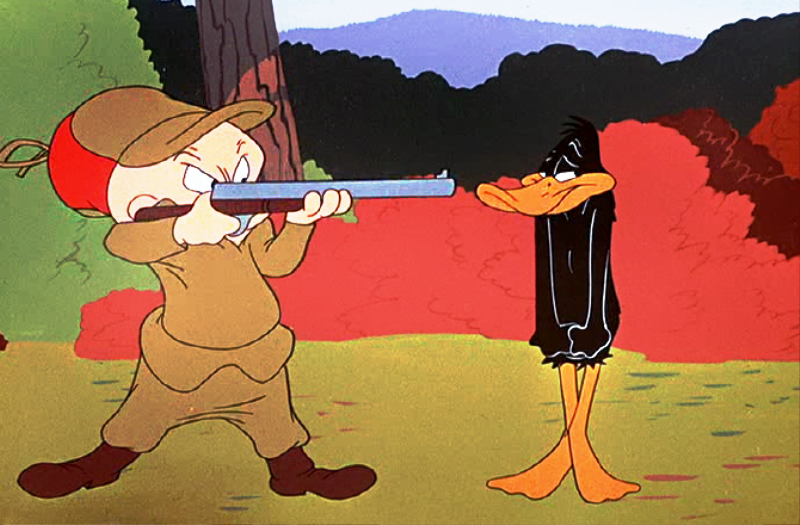

\LARGE{Probability Theory From Scratch}


# Few notes about History


<!-- (am: 1h20 + 1h20 / pm 2h + 15min) -->

```{r setup, echo = FALSE}
library(graphicsutils)
myblue <- "#7eb6d6"
myred <- "#e080a3"
mygreen <- "#d4e09b"
mygrey <- "grey35"
mypar <- list(fg=mygrey, col.lab=mygrey, col.axis=mygrey, bg="transparent", las = 1, cex.main=2, cex.axis=1.4, cex.lab=1.4, bty="l")
```


# Few notes about History

- Chevalier De Méré, Pascal and Fermat: *the problem of points*
  - prediction based on data / envision outcomes

# Few notes about History

- Laplace *Théorie Analytique des Probabilités in 1812* and

- Reverend Bayes *An Essay Towards Solving a Problem in the Doctrine of Chances* posthum I go back to that latter


# Few notes about History

- Kolmogorov / Shannon / update information theory / Mathematization


# Why probability are important

- Statistics
- Stochastic process
- Heisenberg / Einstein  

- Do we need tricky probability in Ecology?
  - Allesina and Tang Science 2012 based on the distribution of Eigen values
  - Coalescent


# Probability space (1/3)

\begin{large}
$\left(\Omega, \mathcal{F}, P\right)$
\end{large}


1. $\Omega$: Sample space set of all possible outcomes  

\begin{itemize}
     \item<4-6> "Head" "Tail"
 \end{itemize}  

\pause

2. $\mathcal{F}$: set of events *i.e.* 0 or more outcomes

\begin{itemize}
     \item<5-6> $\emptyset$, "Head", "Tail", "Head or Tail" ($\Omega$)
 \end{itemize}   

\pause

3. $P$: assign a probability / map events occurrence into [0,1]

\begin{itemize}
     \item<6-6> \alert<6>{$P(\emptyset)=0$};  $P("Head") = p$;  $P("Tail") = 1-p$; \alert<6>{$P(\Omega) = 1$}
 \end{itemize}  


# Probability space (2/3)

\begin{large}
Occurrence of species 1 on an island
\end{large}


1. $\Omega$: Sample space set of all possible outcomes  

\begin{itemize}
     \item<4-6>  {"Present", "Absence"} ({"0", "1"})
 \end{itemize}  

\pause

2. $\mathcal{F}$: set of events *i.e.* 0 or more outcomes

\begin{itemize}
     \item<5-6> $\emptyset$, "0", "1", "1 or 0" ($\Omega$)
 \end{itemize}   

\pause

3. $P$: assign a probability / map events occurrence into [0,1]

\begin{itemize}
     \item<6-6> \alert<6>{$P(\emptyset)=0$};  $P("1") = p$;  $P("0") = 1-p$; \alert<6>{$P(\Omega) = 1$}
 \end{itemize}  

 <!-- Understanding the difference between Omega and F is ++ -->
 <!-- The set of question F allows is huge and we need to combine outcomes properly -->


# Probability space (3/3)

  \begin{large}
  Occurrence of species 1 and species 2 on an island
  \end{large}

   1. $\Omega$

   \begin{itemize}
        \item<2-4> {"00", "01", "10", "11"}
    \end{itemize}  

   2. $\mathcal{F}$

   \begin{itemize}
        \item<3-4> $\emptyset$, $\Omega$, "01", "at least one species"
    \end{itemize}   

   3. $P$: assigns probabilities to events


<!-- On a envie de dire qu'on multiplie les proba... mais il faut penser que... Question how to combine events -->


# Combining events

- Let's "A" and "B" denotes two distinct events:

    - $\overline{A}$: "complement of A"
    \pause
    - $A \bigcup B$: "A or B"
    \pause
    - $A \bigcap B$: "A and B"


# Combining events

```{r omega, echo = FALSE, fig.width=6, fig.height=4.5}
par(xaxs="i", yaxs="i")
plot0(c(0,1), fill=myblue)
text(.9,.1, label=expression(Omega), cex=2.6, col=mygrey)
box2(1:4, col=mygrey)
```

\LARGE $P(\Omega) = 1$


# Combining events

```{r emptySet, echo = FALSE, fig.width=6, fig.height=4.5}
##---
par(xaxs="i", yaxs="i")
plot0(c(0,1))
text(.9,.1, label=expression(bar(Omega)), cex=2.6, col=mygrey)
box2(1:4, col=mygrey)
```

\LARGE $P(\overline{\Omega}) = P(\emptyset) = 1 - P(\Omega) = 0$


# Combining events

```{r eventA, echo = FALSE, fig.width=6, fig.height=4.5}
rc1 <- c(.2,.4,.6,.8)
rc2 <-  c(.4,.2,.8,.6)
##---
par(xaxs="i", yaxs="i")
plot0(c(0,1))
rect(rc1[1], rc1[2], rc1[3], rc1[4], col = myblue, border=NA)
text(mean(rc1[c(1,3)]), mean(rc1[c(2,4)]), label="A", cex=2.6, col=mygrey)
box2(1:4, col=mygrey)
```

\LARGE $P(A)$


# Combining events

```{r complement, echo = FALSE, fig.width=6, fig.height=4.5}
par(xaxs="i", yaxs="i")
plot0(c(0,1), fill=myblue)
rect(rc1[1], rc1[2], rc1[3], rc1[4], col = "white", border=NA)
box2(1:4, col=mygrey)
text(.9,.1, label=expression(bar(A)), cex=2.6, col=mygrey)
```

\LARGE $P(\overline{A}) = 1 - P(A)$


# Combining events (5/10)


```{r eventB, echo = FALSE, fig.width=6, fig.height=4.5}
par(xaxs="i", yaxs="i")
plot0(c(0,1))
rect(rc2[1], rc2[2], rc2[3], rc2[4], col = myblue, border=NA)
text(mean(rc2[c(1,3)]), mean(rc2[c(2,4)]), label="B", cex=2.6, col=mygrey)
box2(1:4, col=mygrey)
```

\LARGE $P(B)$


# Combining events

```{r interAB, echo = FALSE}
par(xaxs="i", yaxs="i")
plot0(c(0,1))
rect(rc1[1], rc1[2], rc1[3], rc1[4], col = NA, border=mygrey, lwd=.4)
rect(rc2[1], rc2[2], rc2[3], rc2[4], col = NA, border=mygrey, lwd=.4)
rect(rc2[1], rc1[2], rc1[3], rc2[4], col = myblue, border=NA)
text(.5*(rc2[1]+rc1[3]) , .5*(rc1[2]+rc2[4]), label= expression(A~intersect(B)), cex=2.6, col=mygrey)
box2(1:4, col=mygrey)
```

\LARGE $P(A \bigcap B)$


<!-- we assume this is known we'll come back latter on that -->


# Combining events


```{r eventAB, echo = FALSE, fig.width=6, fig.height=4.5}
par(xaxs="i", yaxs="i")
plot0(c(0,1))
rect(rc1[1], rc1[2], rc1[3], rc1[4], col = myblue, border=NA)
rect(rc2[1], rc2[2], rc2[3], rc2[4], col = myblue, border=NA)
text(mean(rc2[c(1,3)])-.1, mean(rc2[c(2,4)])+.1, label= expression(A~union(B)), cex=2.6, col=mygrey)
box2(1:4, col=mygrey)
```

\LARGE $P(A \bigcup B) = P(A) + P(B) - P(A \bigcap B)$


# Combining events

```{r complementAB, echo = FALSE}
par(xaxs="i", yaxs="i")
plot0(c(0,1), fill=myblue)
rect(rc1[1], rc1[2], rc1[3], rc1[4], col = "white", border=NA)
rect(rc2[1], rc2[2], rc2[3], rc2[4], col = "white", border=NA)
text(.85, .1, label= expression(bar(A~union(B))), cex=2.6, col=mygrey)
box2(1:4, col=mygrey)
```

\LARGE $P(\overline{A \bigcup B}) = 1 - P(A \bigcup B)$


# Combining events - disjoint events

```{r disjoint, echo = FALSE}
par(xaxs="i", yaxs="i")
plot0(c(0,1), fill=myblue)
rect(rc1[1]-.1, rc1[2], rc1[3]-.1, rc1[4], col = "white", border=mygrey)
rect(rc2[1]+.1, rc2[2], rc2[3]+.1, rc2[4], col = "white", border=mygrey)
text(.85, .1, label= expression(bar(A~union(B))), cex=2.6, col=mygrey)
box2(1:4, col=mygrey)
```

\LARGE $P(\overline{A \bigcap B}) = 0$


# Combining events - partition

\large

Consider an event B and a set of events: $A_i$ where i $\in$ \{1,...,n\} ($n$ a natural number) such as:

\pause

1. $\forall$ \{i, j\} \\ $i \neq j$, $P(A_i \bigcap A_j) = 0$  (pairwise disjoint)

\pause

2. $\bigcap_i^n A_i = B$ $\Rightarrow$ $\sum_i^n P(A_i) = P(B)$


then, the set $A_i$ is a partition of B.


# Combining events - partition

```{r partition, echo = FALSE, fig.width=6, fig.height=4.5}
layout(matrix(c(1,1,2,3,4,4,3,5,5),3,3))
par(xaxs="i", yaxs="i", mar=c(0,0,0,0))
for (i in 1:5){
  plot0(c(-1,1), c(-1,1), fill=darken(myblue, 12*(i-1)+1))
  text(0,0, paste0("A",i), cex=2.8, col="white")
}
```

# Combining events - partition

\large

$A_i$ where $i \in \{1, 2, 3, 4, 5\}$ is a partition of $\Omega$

$$\sum_i^5 P(A_i) = 1$$


# Occurrence of species 1 and species 2 on an island

\large

- Events: \{"00", "01", "10", "11"\}

\pause

- $P("00" \bigcap "01") = 0$

\pause

- $"00" \bigcup "01" \bigcup "10" \bigcup "11" = \Omega$

\pause

- p_{00} + p_{01} + p_{10} + p_{11} = 1


"00", "01", "10", "11" are **singleton sets** (a.k.a unit sets).
\{"00", "01", "10", "11"\} a partition of singleton sets.

\pause

This actually describes a **probability distribution**.


# Let's practice 1 (15 min)

\begin{exampleblock}{PRACTICE 1}
  \begin{itemize}
      \item<1-5> $P(\overline{A} \bigcap B) = f(P(A), P(B), P(A \bigcap  B))$
      \item<2-5> $P(A \bigcup B \bigcup C)$
      \item<3-5> the duck hunter 1 bullet
      \item<4-5> the duck hunter 2 bullets / 1 or 2 ducks
      \item<5-5> bonus: how to simulate a dice using a coin?
  \end{itemize}    
\end{exampleblock}


# Let's practice 1 - $P(\overline{A \bigcup B})$

```{r interAcomplB, echo = FALSE}
par(xaxs="i", yaxs="i")
plot0(c(0,1))
rect(rc2[1], rc2[2], rc2[3], rc2[4], col = myblue, border=NA, lwd=.4)
rect(rc1[1], rc1[2], rc1[3], rc1[4], col = "white", border = mygrey, lwd=.4)
rect(rc2[1], rc2[2], rc2[3], rc2[4], col = NA, border=mygrey, lwd=.4)

text(.5*(rc2[1]+rc2[3]), .5*(rc2[2]+rc2[4])-.1, label= expression(bar(A)~intersect(B)), cex=2.6, col=mygrey)
box2(1:4, col=mygrey)
```

\LARGE $P(\overline{A \bigcup B}) = ?$


# Let's practice 1 - $P(A \bigcup B \bigcup C)$

```{r eventABC, echo = FALSE}
par(xaxs="i", yaxs="i")
plot0(c(0,1))
##--
rect(rc2[1]+.1, rc2[2]+.1, rc2[3]+.1, rc2[4]+.1, col = myblue, border = NA, lwd=.4)
rect(rc1[1]+.1, rc1[2]+.1, rc1[3]+.1, rc1[4]+.1, col = myblue, border = NA, lwd=.4)
rect(rc2[1]-.15, rc2[2]-.05, rc2[3]-.15, rc2[4]-.05, col = myblue, border = NA, lwd=.4)
##--
rect(rc2[1]+.1, rc2[2]+.1, rc2[3]+.1, rc2[4]+.1, col = NA, border = mygrey, lwd=.4)
rect(rc1[1]+.1, rc1[2]+.1, rc1[3]+.1, rc1[4]+.1, col = NA, border = mygrey, lwd=.4)
rect(rc2[1]-.15, rc2[2]-.05, rc2[3]-.15, rc2[4]-.05, col = NA, border = mygrey, lwd=.4)
##--
text(c(.35,.8,.3), c(.8,.5,.2), labels=LETTERS[1:3], col=mygrey, cex=2)
box2(1:4, col=mygrey)
```

\LARGE $P(A \bigcup B \bigcup C) = ?$


# Let's practice 1 - the duck hunter

{width=60%}

\vspace{-.5cm}

- Duck hunter with one bullet, one duck: describe what happens.

- Duck hunter with two bullets, one duck: describe what happens.

- Duck hunter with two bullets, two ducks: describe what happens.


# Solution 1 - $P(\overline{A \bigcup B})$


# Solution 1 - $P(A \bigcup B \bigcup C)$

 - See the [Inclusion–exclusion principle](https://en.wikipedia.org/wiki/Inclusion–exclusion_principle) article on wikipedia (formule du crible de Poincaré).


# Solution 1 - the duck hunter


# Random variables

- Flipping the coin / Occurrence of 1 species on a island / shooting a duck
could actually be model similarly

\pause

- Let's say: $X = 1$ ("sucess");  $\overline{X} = 0$ (""failure); $P(X) = p$ ; $\{X;\overline{X}\} = \Omega$; $P(\overline{X}) = 1-p$

\pause

- Doing so = defining a random variable and assigning a probability distribution.


# Random variables and probability distribution

  Formaly:

  $X: X \Omega \rightarrow H$


- A function that assigns probability under certain constraits


# Independence - Intuition

Back to the duck hunter paradigm :

- 1 bullet ok,
- 2 bullets what should we do
    - two different duck (do a tree)
    - using the same bullet duck ()

<!-- Faire des arbres avec R deuxième cas it's like we do not repeat the same think... so we don't know what we do-->
<!-- l'operation mathematique puor faire cette combinaison de branch c'est multiplié -->


# Independence - Definition

\large

To events are independent if and only if:

- $P(A \cap B) = P(A)P(B)$

\pause
three remarks:
  - this is an assumption often implicit (notably in statistics)  

  \pause

  - 2 events that may not seem independent in the common sens may be independent
  independent    

  \pause

  - $P(A \bigcup B) = P(A) + P(B) - P(A)P(B)$


# Let's practice 2 (10 min)

The duck hunter as success rate of $p$ and he is gonna shoot independent ducks!
Let's say he had $n$ try:

  - what's the probability he failed the $n-1$ first shoots and succeed the last one    
  - what's the probability he got exactly $p$ ducks (starts with n=3).


# Solution 2


# Countably infinite set

- discrete values, example binomial

- the number of unsuccessful attempts


<!-- dire quel function est la probab de dictroution -->


# Infinite set

- Time upon arrival

- presence of a species on a give point

- all event have a probabililty of 0.
- in half of the area we wanna say .5...

# Infinite set

    3. distributions pdf/cdf (ex: pdf next slides)


# Example time upon at a party
  <!--I used random names David / William / Amaël -->


# Example of a probability density function (pdf)

<!-- probability distribution function -->
<!-- a probability mass function -->
<!-- add also discrete probab example -->

```{r distrib, echo=FALSE}
seqx <- seq(-7,7,0.1)
par(mypar)
plot(seqx, dnorm(seqx), type="l", col=myblue, lwd=4, main = "dnorm")
```


# Probability distribution

- Probability mass, Probability mass function, p.m.f., Discrete probability distribution function

- Probability mass, Probability mass function, p.m.f., Discrete probability distribution function

- Cumulated $P(X \leq x)$


# Other distribution (exponential / lognormal)

 - Constraints on the function f
 - regularity properties, continuous except on a countable number of point exponentiel is not continous in 0.


# PAUSE

PAUSE \large{PAUSE} \Large{PAUSE} \LARGE{PAUSE} \huge{PAUSE} \Huge{PAUSE}


# PART 2

\huge{The Bayes theorem}


# Expectation / Variance

\large

Notations: $X$, $x$

$$E(X) = \int xf(x)dx$$

\pause

$$V(X) = \int (x-E(x))^2f(x)dx$$


# Moments

\large

$$E(X^n) = \int x^nf(x)dx$$

Moment-generating function (MGF) alternative speciation of the distribution.


# Quantile

\large

$$\alpha ~ | ~ P(X \leq x) = \alpha$$


- media   
- 1st third quartile  
- 5 / 95 percentile   


# Quantile

```{r boxplot, echo=FALSE, fig.width=7, fig.height=5.5}
val <- rnorm(1001)
par(mypar)
par(xaxs="i", yaxs="i")
plot0(c(0.6, 1.8), c(-4,4))
boxplot(val, add=T, outline=F)
abline(h=quantile(val, c(.25,.5,.75)), lty=2, lwd=c(1,1.5,1), col = c(mygreen, 1, mygreen))
text(1.4, quantile(val, .25)-0.25, labels = c("1st quartile"), pos=4, col = mygreen)
text(1.4, quantile(val, .75)+0.25, labels = c("3rd quartile"), pos=4, col = mygreen)
```


# Example Expectation / Variance


# Let's practice 3

\begin{exampleblock}{Practice 4}
    - $p$ success a bullet is 3$ (including the )
    - A duck of the same quality is 60$
    - for which value of $p$ the duck hunter should better stay home?
\end{exampleblock}


# Independence act 2

- Go back to the hunter and duck paradigm (tree for the same duck)


# Independence act 2

Let's A and B be two events:

$$P(A|B) = \frac{P(A \cap B)}{P(B)}$$

$$P(A \bigcap B) = P(A|B)P(B)$$

Independence :

$$P(A|B) = P(A)$$

$$P(A|\overline{B}) = P(A)$$

$$P(A \cap B) = P(A|B)P(B)$$


# Bayes theorem


$$P(A \cap B) = P(B \cap A)$$

\pause

$$P(A|B)P(B) = P(B|A)P(A)$$

\pause

\LARGE

$$P(A|B) = \frac{P(B|A)P(A)}{P(B)}$$


# Bayes theorem

- What the reverend said: the original question he asked!

$$P(A|B) = \frac{P(B|A)P(A)}{P(B)}$$

- Implications: cause/consequence swap


# Bayes theorem

Set of $C_i$ is a partition of B.

$$P(A|B) = \frac{P(B|A)P(A)}{\sum P(C_i)}$$


# Practice 4 (40 min - 3 slides)


\begin{exampleblock}{Practice 4}
\begin{itemize}
    \item<1-2> classical examples (20 min)
    \item<2-2> the duck hunter is back (20 min)
\end{itemize}    
\end{exampleblock}


# LUNCH

\large{LUNCH} \Large{LUNCH} \LARGE{LUNCH} \huge{LUNCH} \Huge{LUNCH}


# Part 3

\Large{Probability theory and statistics }


# Let's go back to the last practice


# Probability theory and statistics  

- Information theory
- Using data to predict
- Frequentists way / Bayesian way
- Estimator / Tests / Bias...


# Practice 4 (1h20 - 6 slides)

1. the hunter and the duck agin again again

1. Hunter and duck again and again
  about the coin? Is is biased? How to proceed.
    - what is the probability of obtaining such results if the $p$ (obtaining T)
    is 0? 1? 0.5? is 0.1?
    - compute $P(p\in[.4,.6])$
    - find a way to get a and b such as $P(p\in[a,b])=.95$
    - Let's introduce a second coin and a new set of data, are the two coins similar?


2. Same kind of exercise with a normal distribution.

3. Find a way to find the best parameter values?

- information update (20 min)


# Let's take a step back


# Project time


----

\begin{alertblock}{AlertBlock}
  Pass auf!
\end{alertblock}
