\huge{CONTEXT}


```{r setup, echo = FALSE}
library(graphicsutils)
myblue <- "#7eb6d6"
myred <- "#e080a3"
mygreen <- "#d4e09b"
mygrey <- "grey35"
mypar <- list(fg=mygrey, col.lab=mygrey, col.axis=mygrey, bg="transparent", las = 1, cex.main=2, cex.axis=1.4, cex.lab=1.4, bty="l")
```


# Context

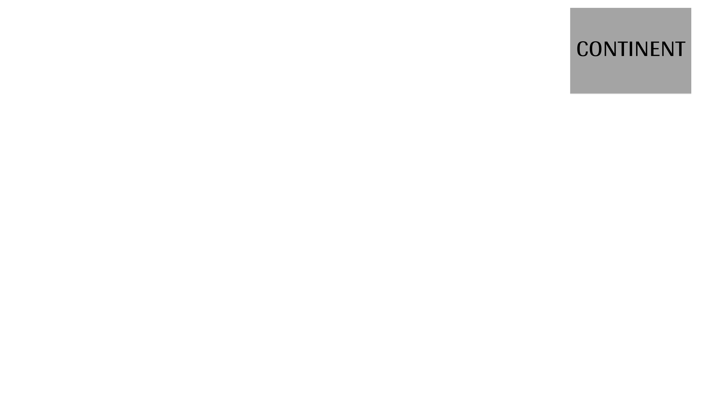

# Context


# Context

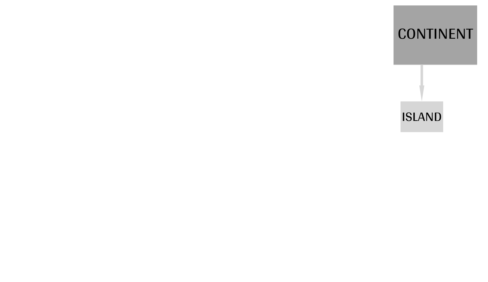

# Context

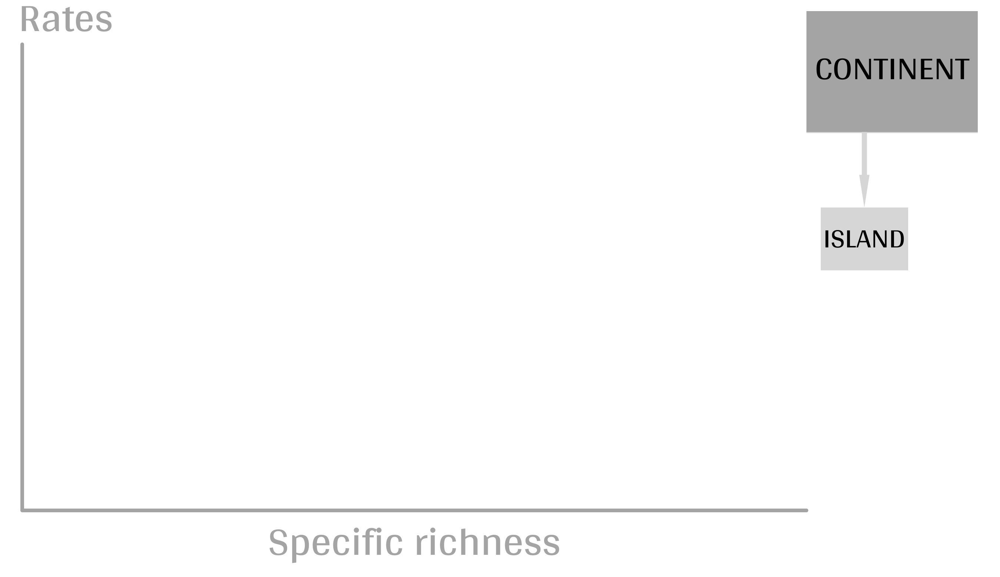

# Context

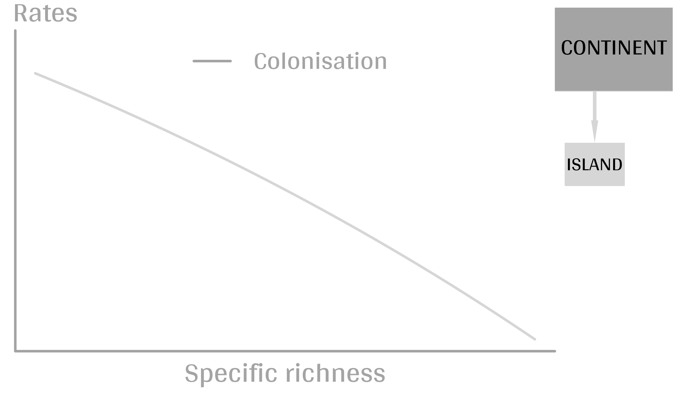

# Context

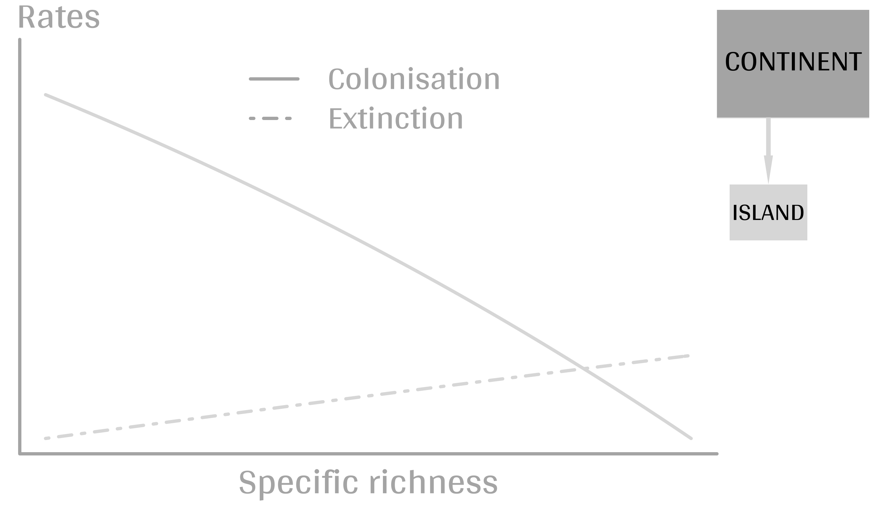

# Context

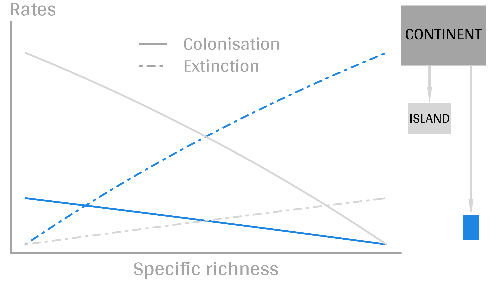

# Context


----

\huge{GOAL}


# Goal

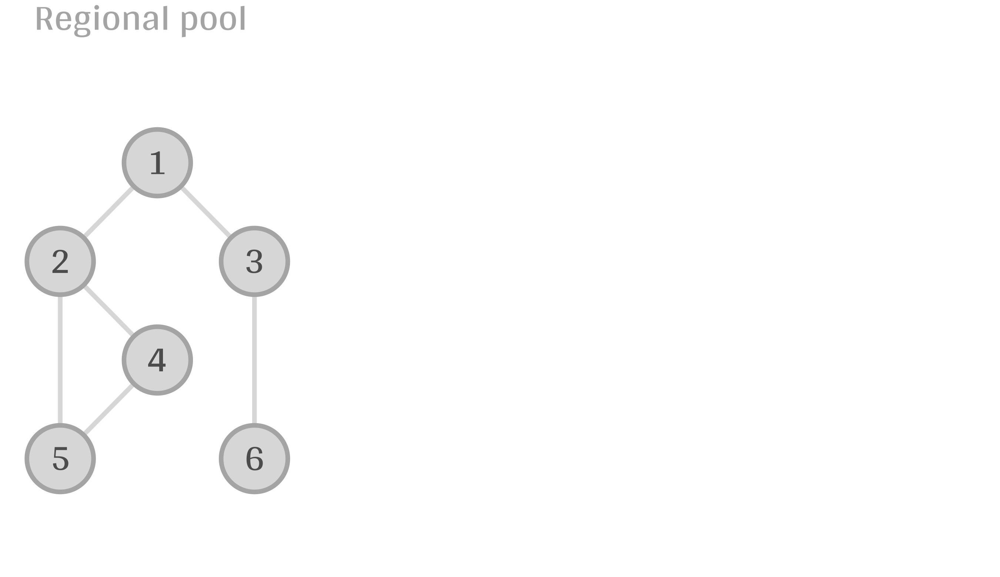

# Goal

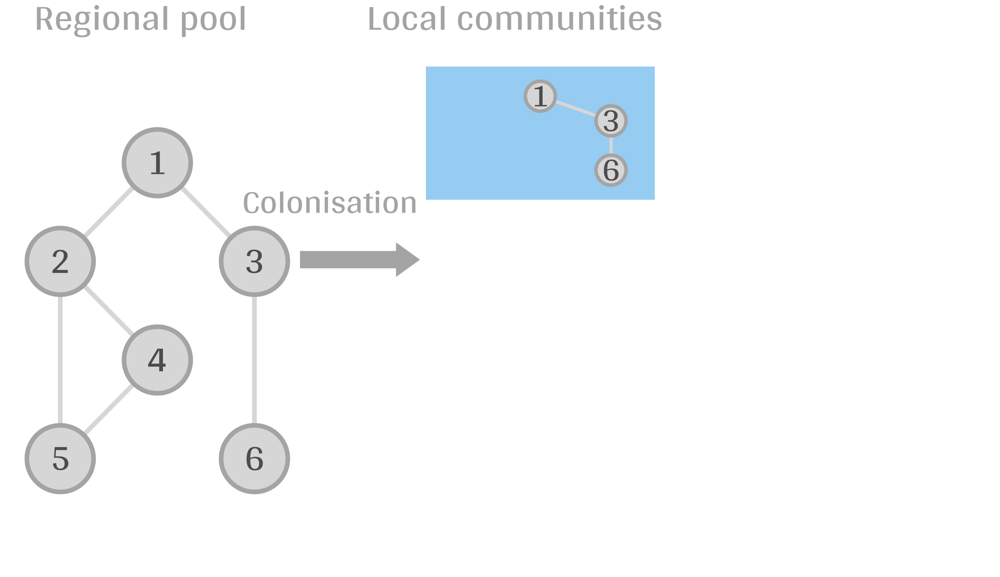

# Goal

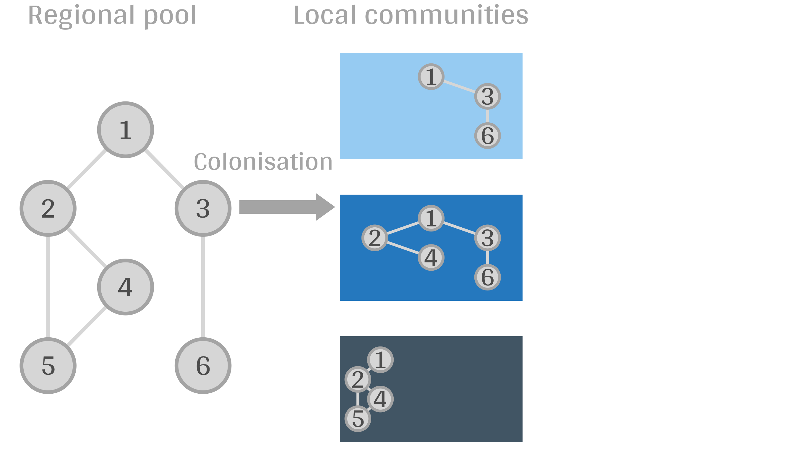

# Goal

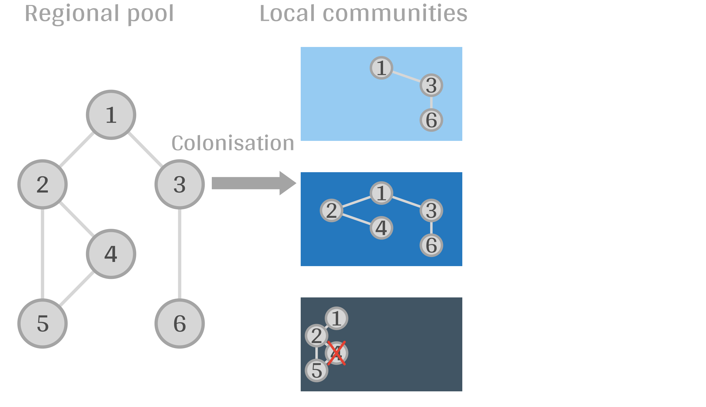

# Goal

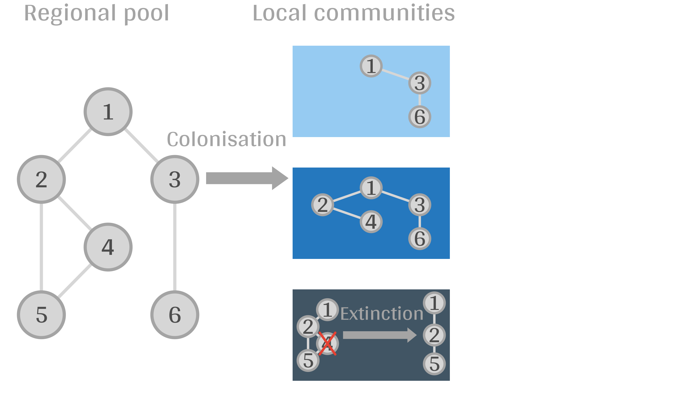

# Goal

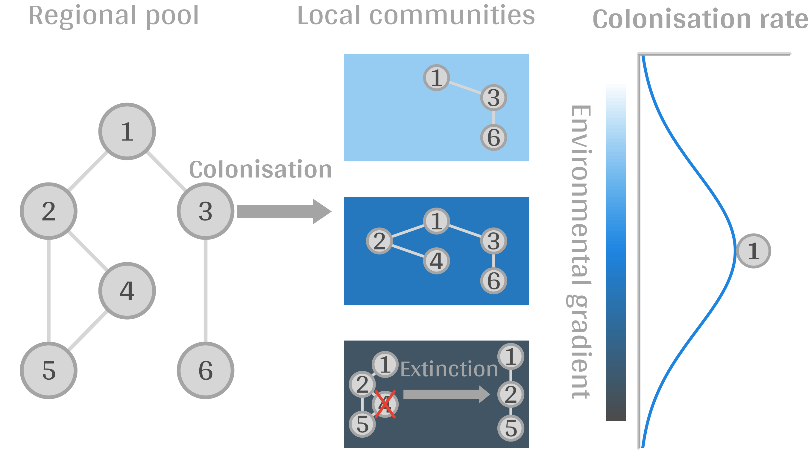

# Goal

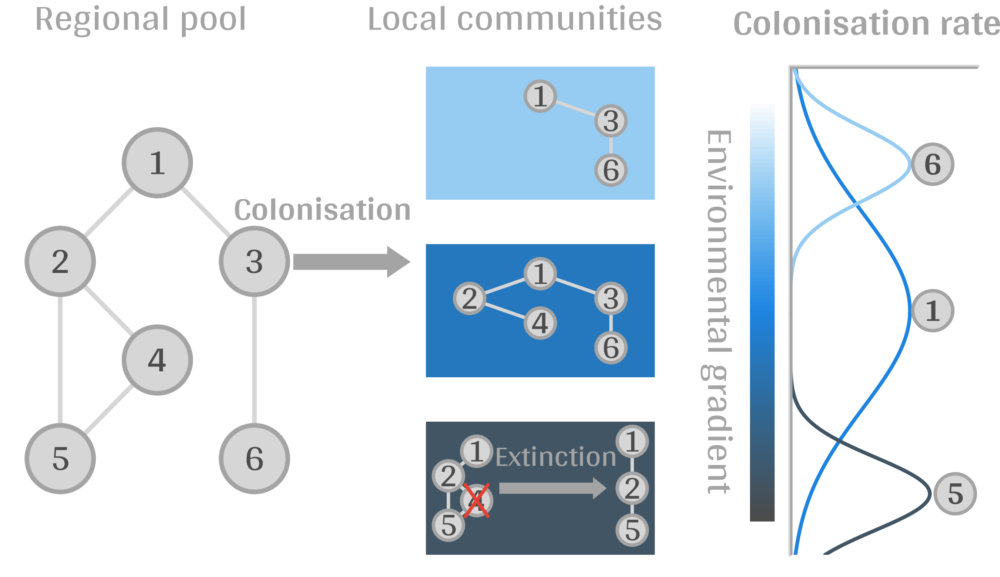

# Goal

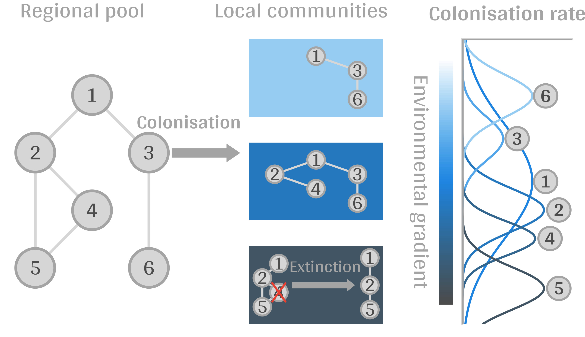


# Classical ODE

1. $S$: species richness on the island

2. $p_i$: occupation rate of species $i$

3. $e_i$: extinction rate

4. $c_i$: colonisation rate

\pause

\large

$$\frac{dp_i}{dt} = c_i(1-p_i) + e_ip_i$$


$$\frac{dS}{dt} = \sum_i \frac{dp_i}{dt}$$


# Classical ODE


$$\frac{dS}{dt} = \sum_i \frac{dp_i}{dt}$$

<br/><br/>

\large

INDEPENDENCE


# Use probability theory

\large

1. $X_i$ is now a **random variable**: 1 presence / 0 absence

2. $X_{i,t}$ presence / absence at time $t$

3. $X_{i,t>0}$ **random process**


# Use probability theory

\large

$X_{i,t>0}$ probability distribution?

\pause

$X_{i,t} \rightarrow X_{i,t+dt}$ \alert{?}

\pause


$P(X_{i,t} \cap X_{i,t+dt}) \pause = P(X_{i,t+dt} | X_{i,t})P(X_{i,t})$
