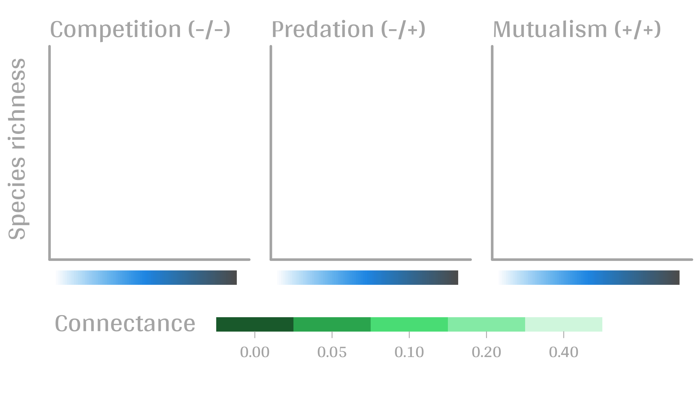
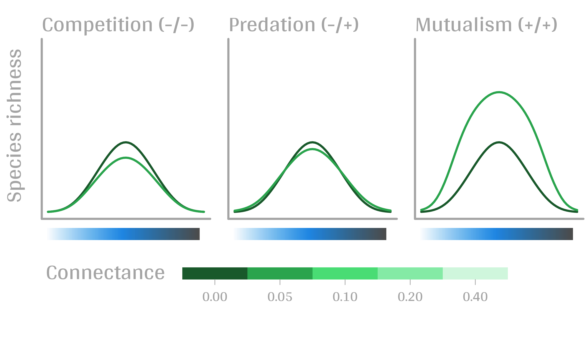
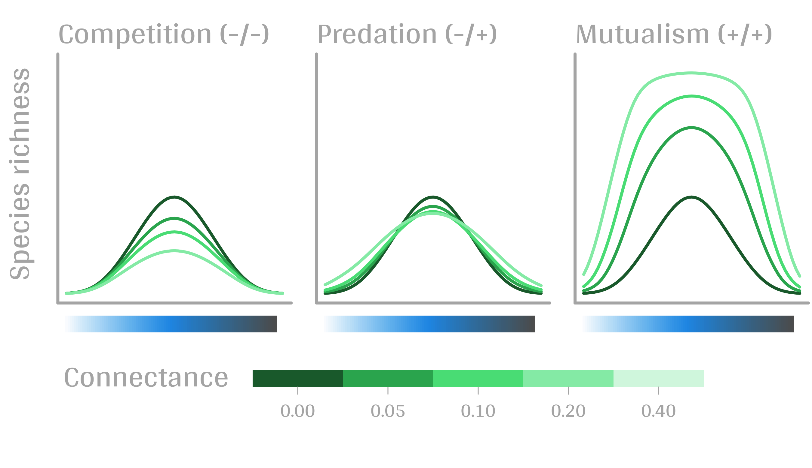
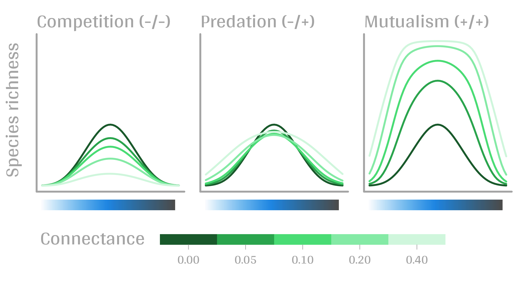

\huge{CONTEXT}


```{r setup, echo = FALSE}
library(graphicsutils)
myblue <- "#7eb6d6"
myred <- "#e080a3"
mygreen <- "#d4e09b"
mygrey <- "grey35"
mypar <- list(fg=mygrey, col.lab=mygrey, col.axis=mygrey, bg="transparent", las = 1, cex.main=2, cex.axis=1.4, cex.lab=1.4, bty="l")
```


# Context


# Context


# Context


# Context


# Context


# Context


# Context


# Context


----

\huge{GOAL}


# Goal


# Goal


# Goal


# Goal


# Goal


# Goal


# Goal


# Goal


# Classical ODE

1. $S$: species richness on the island

2. $p_i$: occupation rate of species $i$

3. $e_i$: extinction rate

4. $c_i$: colonisation rate

\pause

\large

$$\frac{dp_i}{dt}(t) = c_i(1-p_i(t)) - e_ip_i(t)$$

$$\frac{dp_i}{dt}(t) = c_i - (e_i+c_i)p_i(t)$$

$$\frac{dS}{dt}(t) = \sum_i \frac{dp_i(t)}{dt}$$


# Classical ODE


$$\frac{dS}{dt} = \sum_i \frac{dp_i}{dt}$$

<br/><br/>

\large

INDEPENDENCE


# Use probability theory

\large

1. $X_i$ is now a **random variable**: 1 presence / 0 absence

2. $X_{i,t}$ presence / absence at time $t$

3. $X_{i,t>0}$ **random process**


# Use probability theory

\large

$X_{i,t>0}$ probability distribution?

\pause

$X_{i,t} \rightarrow X_{i,t+dt}$ \alert{?}

\pause

law of total probability:

$P(X_{i,t+dt} = 1) = P(X_{i,t+dt} =1 \cap X_{i,t} = 1) + P(X_{i,t+dt} =1 \cap X_{i,t} = 0)$

\pause

$P(X_{i,t+dt} = 0) = 1 - P(X_{i,t+dt} = 1)$


# Use probability theory

$P(X_{i,t+dt} = 1) = P(X_{i,t+dt} = 1 | X_{i,t} = 1) P(X_{i,t} = 1) + P(X_{i,t+dt} =1 | X_{i,t} = 0)P(X_{i,t} = 0)$

\pause

2. $p_{i,t}$: probability of $i$ is present on the island $i$

3. $e_idt$: extinction probability during $dt$

4. $c_idt$: colonisation probability during $dt$


\pause

$p_{i,t+dt} = (1-e_idt) p_{i,t} + c_idt(1-p_{i,t})$


# Use probability theory

$p_{i,t+dt} = (1-e_idt) p_{i,t} + c_idt(1-p_{i,t})$

$p_{i,t+dt} - p_{i,t}  = c_idt - (c_idt+e_idt)p_{i,t})$

$\frac{p_{i,t+dt} - p_{i,t}}{dt}  = c_i - (c_i+e_i)p_{i,t}$

....

$$\frac{dp_i}{dt}(t) = c_i - (e_i+c_i)p_i(t)$$


# So why??

$P(X_{i,t+dt} = 1) = P(X_{i,t+dt} = 1 | X_{i,t} = 1) P(X_{i,t} = 1) + P(X_{i,t+dt} =1 | X_{i,t} = 0)P(X_{i,t} = 0)$

\pause

D = environmental gradient


$P(X_{i,t+dt} = 1) = P(X_{i,t+dt} = 1 | X_{i,t} = 1, D = d) P(X_{i,t} = 1 | D = d) + P(X_{i,t+dt} =1 | X_{i,t} = 0, D = d)P(X_{i,t} = 0 | D = d)$


# Adding environmental gradient

{width=80%}

\pause

$P(X_{i,t+dt} =1 | X_{i,t} = 0, D = d)~~~$ \alert{colonisation = f(d)}


# Adding biotic interactions

2 species:

- $X_{1,t} = 0 \cap X_{2,t} = 0 ~~~ Y_{0, t}$
- $X_{1,t} = 0 \cap X_{2,t} = 1 ~~~ Y_{1, t}$
- $X_{1,t} = 1 \cap X_{2,t} = 0 ~~~ Y_{2, t}$
- $X_{1,t} = 1 \cap X_{2,t} = 1 ~~~ Y_{3, t}$

\pause

Law of total probability:

$P(Y_{0, t+dt}) = P(Y_{0, t+dt}|Y_{0, t})P(Y_{0, t}) + P(Y_{0, t+dt}|Y_{1, t})P(Y_{1, t}) + P(Y_{0, t+dt}|Y_{2, t})P(Y_{2, t})+ P(Y_{0, t+dt}|Y_{3, t})P(Y_{3, t})$


# Adding biotic interactions

n species:

$Y_k~~k\in{0,...2^n-1}$

Find $P(Y_{k,t+1}|Y_{l,t})$


# Results



# Results


# Results



# Results


# Results



# Results




# References

1. Cazelles, K., Mouquet, N., Mouillot, D. & Gravel, D. On the integration of biotic interaction and environmental constraints at the biogeographical scale. Ecography (Cop.). 39, 921–931 (2016).

2. Gravel, D., Massol, F., Canard, E., Mouillot, D. & Mouquet, N. Trophic theory of island biogeography. Ecol. Lett. 14, 1010–1016 (2011).

3. Massol, F. et al. Island Biogeography of Food Webs in 183–262 (2017).
